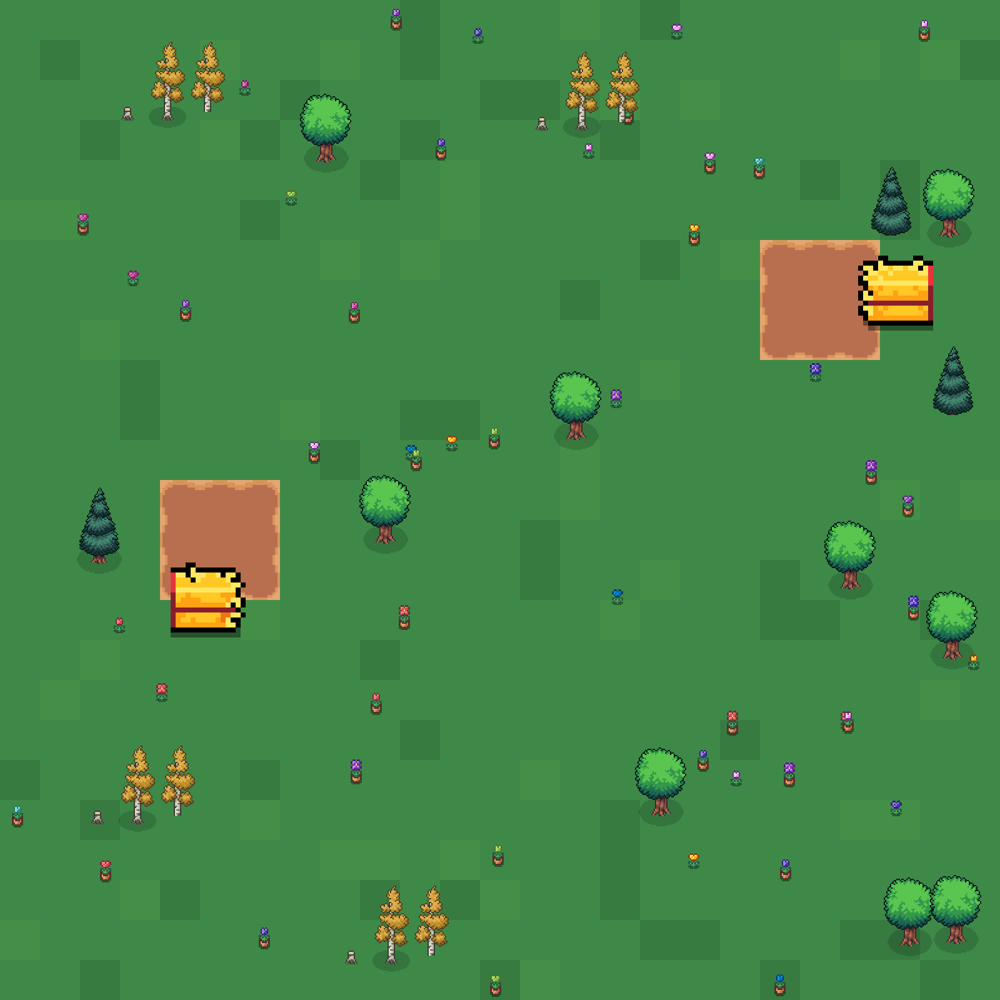
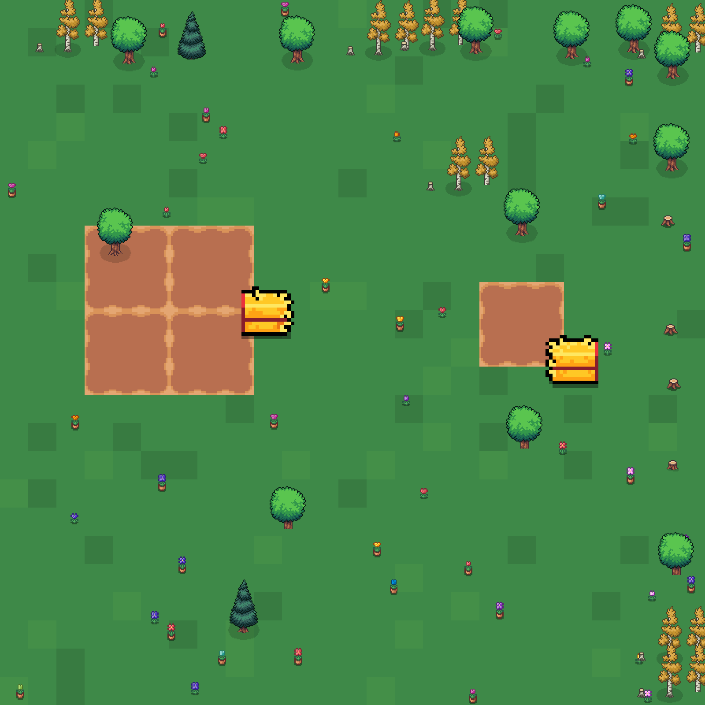
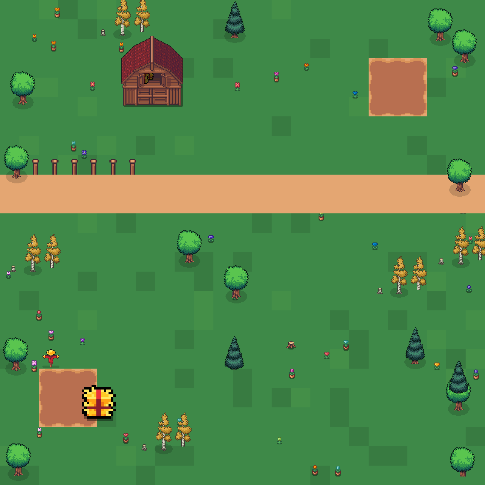
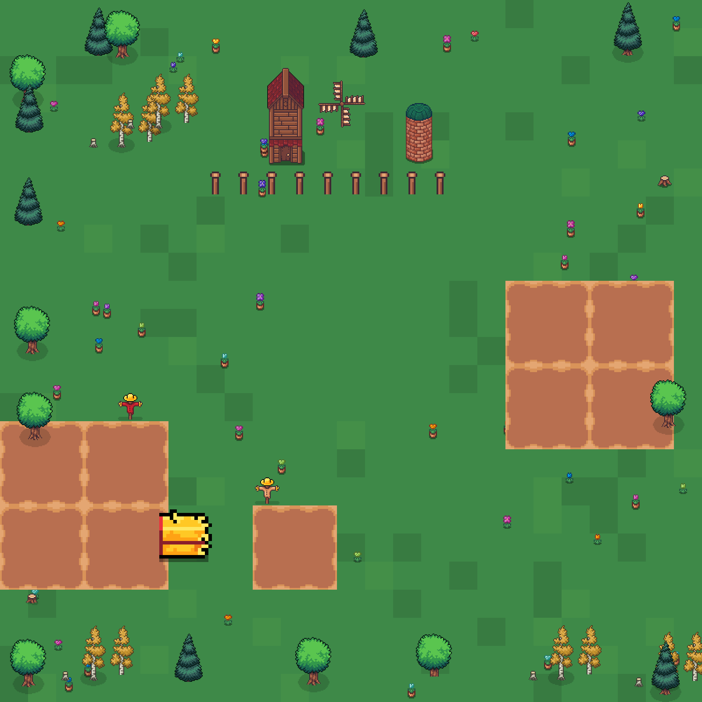

<h1 align="center">Cropland</h1>

<p align="center">
  <em>A multiplayer farming protocol on Solana. Stake land. Grow yield. Trade everything.</em>
</p>

<p align="center">
  <a href="https://cropland.fun"></a>
  <a href="https://pump.fun/coin/4R5KQBuarwMXZB4hh4G3RdP16BUbVFgaEH92VmENpump"></a>
  <a href="https://x.com/cropfun"></a>
  <a href="https://medium.com/@CropLandFun"></a>
</p>

<p align="center">
  
  
  
  
  
  
  
</p>

---

## What is Cropland

Cropland is a multiplayer farming game where every plot of land is a real, stake-backed position on Solana. There are 100 plots in the world. They are unevenly distributed across four tiers — Bronze, Silver, Gold, Diamond — and they don't mint, airdrop, or expand. Once they're claimed, they're claimed, and the only way more come back to the market is when someone abandons theirs.

You don't rent a plot. You stake into it. The USDC you commit on claim is locked in a non-custodial vault tied to that plot, and stays locked until you transfer the plot or abandon it. Walk away, and your stake is forfeited — half burned, half to the protocol treasury.

That single design choice is what separates Cropland from a farming game. The cost of holding land is real. The cost of giving up on land is also real. Every system layered on top — markets, tribes, alliances, raids, the yield engine — is weighted by it.

> **Land you don't believe in, you don't claim. Land you do, you defend.**

Play now at **[cropland.fun](https://cropland.fun)** · Follow updates on **[@cropfun](https://x.com/cropfun)** · Read more on **[Medium](https://medium.com/@CropLandFun)**.

---

## World Preview

A glimpse of four claimed plots — Bronze, Silver, Gold, Diamond — generated from the world's deterministic seed.

<table>
  <tr>
    <td align="center"><br><strong>Bronze</strong> · 50 supply · 1.0× yield</td>
    <td align="center"><br><strong>Silver</strong> · 30 supply · 1.5× yield</td>
  </tr>
  <tr>
    <td align="center"><br><strong>Gold</strong> · 15 supply · 2.0× yield</td>
    <td align="center"><br><strong>Diamond</strong> · 5 supply · 3.0× yield</td>
  </tr>
</table>

---

## Architecture

```
┌──────────────────────────────────────────────────────────────────┐
│                      Cropland Program (Anchor)                   │
│                                                                  │
│   Plot   ──┐                                                     │
│   Player  ─┼──> claim · abandon · upgrade ──> Plot Vault (PDA)  │
│   Tribe   ─┤                                                     │
│   Alliance┘                                                      │
│                                                                  │
│   PlotOffer ──> list · accept ──> atomic ownership transfer     │
│                                                                  │
│   Order ──> place_order ──> match_book ──> escrow settlement    │
│                                                                  │
│   Harvest ──> compute_yield(tier × upgrade × tribe × ally × GH) │
└──────────────────────────────────────────────────────────────────┘
```

All state lives on-chain in PDAs. The program handles claim staking, plot transfer, the order book, social membership, and the multiplicative yield engine. Frontend reads accounts, signs instructions, and renders.

---

## Plot Tiers

| Tier    | Supply | Stake Cost | Crop Slots | Animal Slots | Base Yield |
| :------ | :----: | :--------: | :--------: | :----------: | :--------: |
| Bronze  |   50   |   1 USDC   |     4      |      1       |   1.0×     |
| Silver  |   30   |   5 USDC   |     6      |      2       |   1.5×     |
| Gold    |   15   |  15 USDC   |     8      |      3       |   2.0×     |
| Diamond |    5   |  50 USDC   |    10      |      5       |   3.0×     |

Each wallet is capped at **5 plots total**. The cap is enforced at the program level, not the UI.

---

## Smart Contracts

The full Anchor program lives in [`programs/cropland/src/`](programs/cropland/src/). Below is the shape of the protocol at a glance.

### The plot account

```rust
#[account]
pub struct Plot {
    pub id:            u8,            // 0..100
    pub owner:         Pubkey,        // Pubkey::default() when unclaimed
    pub tier:          PlotTier,
    pub locked_amount: u64,           // USDC base units in the plot vault
    pub claimed_at:    i64,
    pub upgrade_level: u8,            // 1..=4
    pub last_harvest:  i64,
    pub bump:          u8,
}

#[derive(AnchorSerialize, AnchorDeserialize, Clone, Copy)]
pub enum PlotTier { Bronze, Silver, Gold, Diamond }
```

Each plot has its own vault PDA, derived from `[b"vault", plot_id]`. When you stake, USDC moves from your associated token account into that vault. The vault holds it for as long as you hold the plot.

### Claim

```rust
pub fn claim_plot(ctx: Context<ClaimPlot>, plot_id: u8, tier: PlotTier) -> Result<()> {
    let plot   = &mut ctx.accounts.plot;
    let player = &mut ctx.accounts.player;

    require!(plot.owner == Pubkey::default(),          ErrorCode::AlreadyClaimed);
    require!(player.plot_count < MAX_PLOTS_PER_WALLET, ErrorCode::TooManyPlots);

    let cost = tier.claim_cost();
    transfer(/* player_token -> plot_vault */, cost)?;

    plot.owner         = ctx.accounts.player_signer.key();
    plot.tier          = tier;
    plot.locked_amount = cost;
    plot.claimed_at    = Clock::get()?.unix_timestamp;
    plot.upgrade_level = 1;

    player.plot_count += 1;
    Ok(())
}
```

### Abandon (forfeit)

```rust
pub fn abandon_plot(ctx: Context<AbandonPlot>) -> Result<()> {
    let plot = &mut ctx.accounts.plot;
    require!(plot.owner == ctx.accounts.player_signer.key(), ErrorCode::NotOwner);

    let stake    = plot.locked_amount;
    let burn     = stake * ABANDON_BURN_BPS     / 10_000;   // 50%
    let treasury = stake * ABANDON_TREASURY_BPS / 10_000;   // 50%

    transfer(/* vault -> burn_vault */,     burn)?;
    transfer(/* vault -> treasury_vault */, treasury)?;

    plot.owner         = Pubkey::default();
    plot.locked_amount = 0;
    Ok(())
}
```

The locked stake does **not** return to the player. Half is burned. Half goes to the protocol treasury. The plot returns to world supply, available to the next farmer.

### Plot exchange — atomic settlement

The accept instruction is guarded against three race conditions with a single optimistic concurrency check:

```rust
pub fn accept_plot_offer(ctx: Context<AcceptPlotOffer>) -> Result<()> {
    let offer = &mut ctx.accounts.offer;
    let plot  = &mut ctx.accounts.plot;
    let buyer = ctx.accounts.buyer.key();

    require!(offer.status == OfferStatus::Open,        ErrorCode::OfferClosed);
    require!(plot.owner   == offer.seller,             ErrorCode::SellerNoLongerOwns);
    require!(offer.seller != buyer,                    ErrorCode::SelfTrade);
    require!(
        offer.buyer.map_or(true, |b| b == buyer),
        ErrorCode::OfferNotForYou,
    );

    let fee = offer.price * FEE_BPS / 10_000;     // 2.5%
    let net = offer.price - fee;
    transfer(/* buyer -> seller */,   net)?;
    transfer(/* buyer -> treasury */, fee)?;

    plot.owner   = buyer;
    offer.status = OfferStatus::Accepted;
    Ok(())
}
```

The line that does the heavy lifting is `require!(plot.owner == offer.seller)`. If anything changed the plot's owner since the offer was posted — another sale, an abandonment, a raid that flipped the deed — the check fails, the transaction reverts, and no USDC moves. The buyer's funds are safe. The seller's plot is safe.

Either everything happens or nothing happens. There's no half-state. There's no race.

### Order book — continuous matching

Crops, animal products, fish, herbs all trade through a single continuous order book. Place an ask, the program locks your inventory in escrow. Place a bid, the program locks your USDC. New orders are matched against the existing book on insert.

```rust
pub fn match_book(item: ItemType, asks: &mut [Order], bids: &mut [Order]) -> Result<()> {
    for ask in asks.iter_mut() {
        for bid in bids.iter_mut() {
            if bid.price < ask.price        { break; }       // book exhausted at price
            if bid.maker == ask.maker       { continue; }    // self-match guard

            let qty   = ask.remaining.min(bid.remaining);
            let price = ask.price;                            // patient seller wins ties
            let gross = qty * price;
            let fee   = gross * FEE_BPS / 10_000;
            let net   = gross - fee;

            settle_payment(ask.maker, net, fee)?;
            settle_delivery(bid.maker, item, qty)?;

            ask.remaining -= qty;
            bid.remaining -= qty;
            if ask.remaining == 0 { ask.status = OrderStatus::Filled; break; }
        }
    }
    Ok(())
}
```

A 2.5% protocol fee is split between the treasury and the burn vault. Self-matching is prevented at the pair level so wallets can't fake volume.

### Tribes and alliances

```rust
pub const TRIBE_MAX_MEMBERS:    u8 = 10;
pub const ALLIANCE_MAX_MEMBERS: u8 =  5;

#[account]
pub struct Tribe {
    pub id:           u64,
    pub name:         [u8; 32],
    pub tag:          [u8; 4],
    pub leader:       Pubkey,
    pub home_plot:    Pubkey,
    pub member_count: u8,
    pub invite_code:  [u8; 8],
    /* ... */
}
```

Two parallel social systems with intentionally different commitment levels:

- **Tribes** — up to 10 members, an explicit leader, applications, kicks, an invite code. Members get a flat **+10%** harvest bonus. The leader gets **+5% per other member**, scaling with tribe size up to **+45%** at full ten-member tribes.
- **Alliances** — up to 5 members, no leader, no applications, just join and leave. Everyone gets a flat **+5%** harvest bonus.

A wallet can be in one tribe **and** one alliance simultaneously. The bonuses stack.

---

## The Yield Engine

Every harvest in Cropland passes through a single pure function. Multipliers compose **multiplicatively**, not additively.

```rust
pub fn compute_yield(
    base:            u64,
    tier:            PlotTier,
    upgrade_level:   u8,
    in_tribe:        bool,
    is_tribe_leader: bool,
    tribe_members:   u8,
    in_alliance:     bool,
    golden_hour:     bool,
) -> u64 {
    let tier_bps     = tier.yield_bps();                    // 10_000..=30_000
    let upgrade_bps  = upgrade_bps(upgrade_level);          // 10_000..=20_000

    let tribe_bps = if !in_tribe {
        10_000
    } else if is_tribe_leader {
        10_000 + 500 * tribe_members.saturating_sub(1) as u64
    } else {
        11_000                                              // member: +10%
    };

    let alliance_bps = if in_alliance { 10_500 } else { 10_000 };
    let golden_bps   = if golden_hour { 12_000 } else { 10_000 };

    base
      * tier_bps     / 10_000
      * upgrade_bps  / 10_000
      * tribe_bps    / 10_000
      * alliance_bps / 10_000
      * golden_bps   / 10_000
}
```

### Worked example: maxed-out farmer

A farmer on a **Diamond** plot, **level 4**, in a **10-member tribe** as a member, in an **alliance**, harvesting during **Golden Hour**. Base wheat yield: 100.

| Multiplier      | Factor | Running |
| :-------------- | -----: | ------: |
| Base            |        |     100 |
| Diamond tier    |  3.00× |     300 |
| Level 4 upgrade |  2.00× |     600 |
| Tribe member    |  1.10× |     660 |
| Alliance        |  1.05× |     693 |
| Golden Hour     |  1.20× |     831 |

The same plot, level-1, no tribe, no alliance, off Golden Hour, base 100, returns 100. The maxed farmer earns **8.31×** what an unaffiliated player would receive from the same harvest tick.

> Cropland rewards dedication out of proportion to effort. Anyone can show up. Fewer can build the structure.

### Golden Hour

```rust
pub fn is_golden_hour(now: i64) -> bool {
    const CYCLE:  i64 = 6 * 60 * 60;   // 6 hours
    const WINDOW: i64 = 1 * 60 * 60;   // 1 hour
    now.rem_euclid(CYCLE) < WINDOW
}
```

Every six hours, for one hour, every harvest in the world gets +20%. There's no cron, no oracle, no off-chain scheduler — it's a pure function of the program clock. Tribe leaders organize harvest rallies around it. The order book sees a volume spike. Good farmers schedule themselves.

---

## $CROP Token

The protocol's community token is **$CROP**, live on Solana via [Pump.fun](https://pump.fun/coin/4R5KQBuarwMXZB4hh4G3RdP16BUbVFgaEH92VmENpump).

**Contract address:**

```
4R5KQBuarwMXZB4hh4G3RdP16BUbVFgaEH92VmENpump
```

$CROP holders get priority access to upcoming drops — including the **free Farmer NFT mint window**.

> Cropland's in-game stakes, trades, and fees are denominated in USDC. $CROP is the community ticker — a coordination token, not the unit of account.

---

## Tokenomics

In-game economics are denominated in USDC.

| Action                | Fee                              | Destination                   |
| :-------------------- | :------------------------------- | :---------------------------- |
| Plot claim            | None (full stake locked)         | Plot vault PDA                |
| Plot abandon          | 100% of stake                    | 50% burn / 50% treasury       |
| Plot upgrade          | 5 / 15 / 40 USDC (level 2/3/4)   | Treasury (with partial burn)  |
| Plot trade            | 2.5% of price                    | Treasury (with partial burn)  |
| Order book fill       | 2.5% of gross                    | Treasury (with partial burn)  |
| Harvest               | None                             | —                             |

A portion of every fee is permanently burned, reducing the circulating supply over time. The remainder funds the protocol treasury — used for liquidity, audits, and ongoing development.

---

## Repository Layout

```
cropland/
├── Anchor.toml
├── Cargo.toml                    # workspace
├── programs/
│   └── cropland/
│       ├── Cargo.toml
│       └── src/
│           ├── lib.rs            # #[program] entrypoint and dispatchers
│           ├── state.rs          # accounts, enums, constants, yield engine
│           ├── instructions.rs   # all instruction Contexts + handlers
│           └── errors.rs         # ErrorCode
├── assets/                       # README artwork
├── LICENSE                       # MIT
└── README.md
```

---

## Roadmap

- [x] Core program: plots, claim/abandon, upgrades
- [x] P2P plot exchange with atomic settlement
- [x] Continuous order book with self-match guard
- [x] Tribes (10-member) and Alliances (5-member)
- [x] Multiplicative yield engine + Golden Hour
- [x] Devnet deployment
- [ ] Mainnet deployment + initial liquidity
- [ ] On-chain raid / steal mechanic with defender stacking
- [ ] Plot leasing (yield rights without ownership transfer)
- [ ] Cross-tribe coordination contracts
- [ ] Mobile companion app

---

## Security

The program follows Anchor's account-constraint discipline throughout. Every state-changing instruction is guarded by ownership checks, signer requirements, and PDA seed validation. Optimistic concurrency is used wherever a transaction's preconditions could change between signing and settlement (most notably the plot-trade `accept` path).

Independent review is in progress. Findings will be published in this repository as they are addressed.

---

## Links

- **Site** — [cropland.fun](https://cropland.fun)
- **Twitter / X** — [@cropfun](https://x.com/cropfun)
- **Medium** — [@CropLandFun](https://medium.com/@CropLandFun)
- **Source** — you're reading it

---

<p align="center">
  <em>Cropland — the world has 100 plots. There are 5 diamonds. Find yours.</em>
</p>
